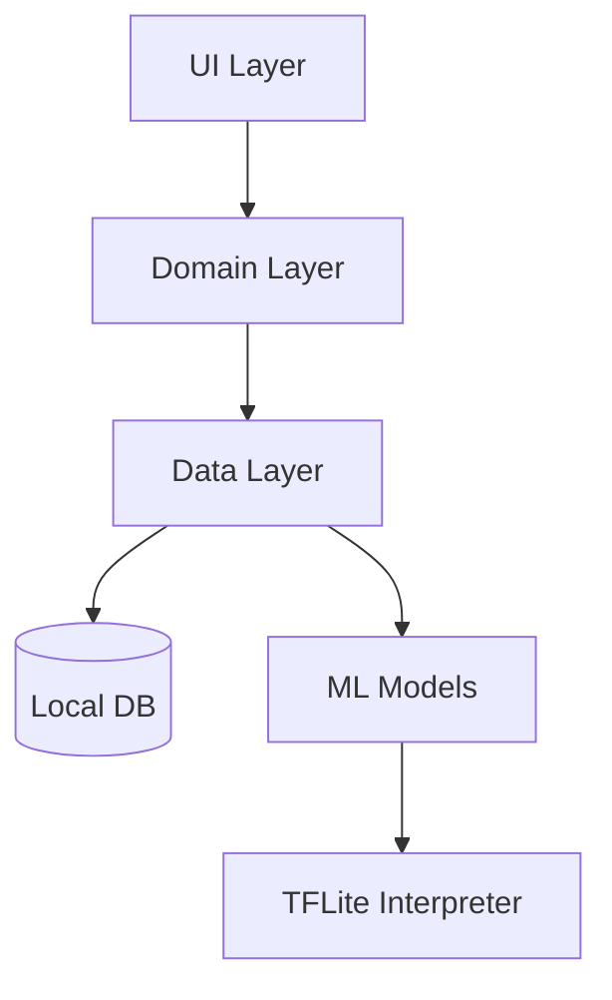
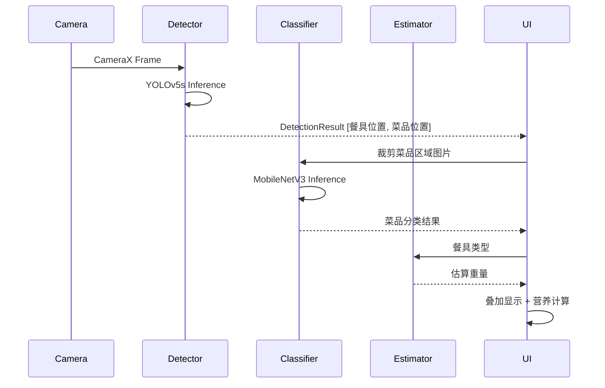
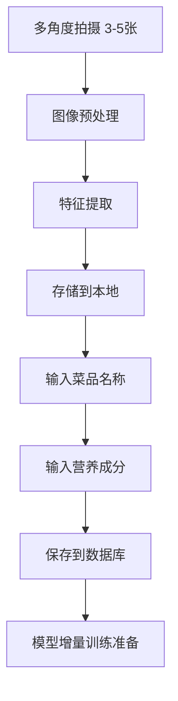

# 小碗菜识别系统技术设计

需求名称：dish-recognition
更新日期：2026-04-09

## 1. 概述

本项目是一款 Android 端小碗菜识别应用，主要功能包括：
- 实时识别餐桌上的菜品与餐具
- 通过多角度拍照添加新菜品到个人菜谱库
- 基于餐具类型估算菜品重量并计算营养成分

### 技术约束

| 约束项 | 选择 |
|--------|------|
| 模型部署 | 本地离线（TensorFlow Lite） |
| 营养数据库 | 自建本地 SQLite |
| 重量估算 | 基于餐具类型映射表 |
| 网络要求 | 无需网络，纯离线运行 |

---

## 2. 系统架构

### 2.1 整体架构

```
┌─────────────────────────────────────────────────────────────┐
│                        Android App                          │
├─────────────────────────────────────────────────────────────┤
│  UI Layer (Jetpack Compose)                                 │
│  ┌─────────────┐ ┌─────────────┐ ┌─────────────┐           │
│  │  CameraScreen│ │  DishListScreen│ │  NutritionScreen│ │
│  └─────────────┘ └─────────────┘ └─────────────┘           │
├─────────────────────────────────────────────────────────────┤
│  Domain Layer                                                │
│  ┌─────────────┐ ┌─────────────┐ ┌─────────────┐           │
│  │ RecognitionUseCase│ │ AddDishUseCase │ │ NutritionUseCase│ │
│  └─────────────┘ └─────────────┘ └─────────────┘           │
├─────────────────────────────────────────────────────────────┤
│  Data Layer                                                  │
│  ┌─────────────┐ ┌─────────────┐ ┌─────────────┐           │
│  │ TFLiteModelRepo│ │ DishRepository │ │ NutritionRepository│ │
│  └─────────────┘ └─────────────┘ └─────────────┘           │
├─────────────────────────────────────────────────────────────┤
│  ML/CV Layer                                                 │
│  ┌─────────────────────┐ ┌─────────────────────┐           │
│  │ ObjectDetectionModel│ │ DishClassifierModel │           │
│  │   (YOLOv5s-TFLite)  │ │  (MobileNetV3-TFLite)│           │
│  └─────────────────────┘ └─────────────────────┘           │
├─────────────────────────────────────────────────────────────┤
│  Local Database (Room)                                      │
│  ┌─────────────┐ ┌─────────────┐ ┌─────────────┐           │
│  │   DishEntity │ │NutritionEntity│ │ TablewareMapping │ │
│  └─────────────┘ └─────────────┘ └─────────────┘           │
└─────────────────────────────────────────────────────────────┘
```

### 2.2 模块依赖关系



---

## 3. 组件与接口

### 3.1 核心组件

| 组件 | 职责 | 输入 | 输出 |
|------|------|------|------|
| `ObjectDetectionModel` | 实时检测餐具和菜品 | Camera Frame | DetectionResult[List[BoundingBox]] |
| `DishClassifierModel` | 菜品分类/识别 | Cropped Image | ClassificationResult |
| `NutritionRepository` | 营养成分查询 | dish_id | NutritionInfo |
| `WeightEstimator` | 基于餐具估算重量 | TablewareType | EstimatedWeight |
| `DishRepository` | 菜品CRUD | DishEntity | Long(dishId) |

### 3.2 主要接口

```kotlin
interface RecognitionUseCase {
    suspend fun recognizeDish(frame: ByteArray): Flow<RecognitionResult>
}

interface AddDishUseCase {
    suspend fun addNewDish(images: List<ByteArray>, name: String): Long
}

interface NutritionUseCase {
    suspend fun getNutritionInfo(dishId: Long, tablewareType: TablewareType): NutritionInfo
}
```

### 3.3 屏幕导航

```
MainScreen (BottomNavigation)
├── CameraScreen (实时识别)
│   └── RecognitionOverlay (识别结果叠加层)
├── DishListScreen (菜品列表)
│   └── AddDishScreen (添加新菜品 - 多角度拍照)
└── NutritionScreen (营养统计)
```

---

## 4. 数据模型

### 4.1 数据库 Schema (Room)

```kotlin
@Entity(tableName = "dishes")
data class DishEntity(
    @PrimaryKey(autoGenerate = true) val id: Long = 0,
    val name: String,
    val imageUrls: List<String>,  // 多角度图片路径
    val createdAt: Long,
    val updatedAt: Long
)

@Entity(tableName = "nutrition")
data class NutritionEntity(
    @PrimaryKey val dishId: Long,
    val calories: Float,      // 热量 (kcal)
    val fat: Float,            // 脂肪 (g)
    val protein: Float,       // 蛋白质 (g)
    val carbohydrate: Float,  // 碳水化合物 (g)
    val vitamin: Float,       // 维生素 (mg)
    val sodium: Float         // 钠 (mg)
)

@Entity(tableName = "tableware_mapping")
data class TablewareMappingEntity(
    @PrimaryKey val tablewareType: String,  // "small_bowl", "plate", etc.
    val defaultWeight: Float  // 默认重量 (g)
)
```

### 4.2 营养成分单位

| 成分 | 单位 | 说明 |
|------|------|------|
| 热量 | kcal | 千卡 |
| 脂肪 | g | 克 |
| 蛋白质 | g | 克 |
| 碳水化合物 | g | 克 |
| 维生素 | mg | 毫克 |
| 钠 | mg | 毫克 |

### 4.3 餐具类型映射

| 餐具类型 | 估算重量 | 适用场景 |
|----------|----------|----------|
| 小碗 | 150g | 汤类、小份菜 |
| 中碗 | 250g | 主食、米饭 |
| 大碗 | 400g | 面条、炖菜 |
| 小盘 | 100g | 凉菜、小食 |
| 中盘 | 200g | 炒菜 |
| 大盘 | 350g | 整鱼、排骨 |
| 长盘 | 300g | 饺子、包子 |

---

## 5. ML 模型设计

### 5.1 目标检测模型

| 项目 | 方案 |
|------|------|
| 模型 | YOLOv5s (converted to TFLite) |
| 输入 | 640x640 RGB Image |
| 输出 | BoundingBox + Class + Confidence |
| 类别 | dish, small_bowl, medium_bowl, large_bowl, small_plate, medium_plate, large_plate, long_plate |
| 推理时间 | < 50ms (Snapdragon 865) |

### 5.2 菜品分类模型

| 项目 | 方案 |
|------|------|
| 模型 | MobileNetV3-Large (fine-tuned) |
| 输入 | 224x224 RGB Image |
| 输出 | Top-K 菜品分类概率 |
| 训练方式 | Transfer Learning from ImageNet |
| 自定义类别 | 用户添加的菜品 |

### 5.3 模型文件结构

```
assets/
├── models/
│   ├── yolov5s.tflite              # 目标检测模型
│   └── mobilenetv3_dish.tflite     # 菜品分类模型
├── labels/
│   ├── detection_labels.txt        # 检测标签
│   └── classification_labels.txt   # 分类标签
└── nutrition/
    └── nutrition_data.db          # 营养数据库
```

---

## 6. 核心流程

### 6.1 实时识别流程



### 6.2 添加新菜品流程



### 6.3 营养计算流程

```
营养估算 = 菜品单位营养 × 估算重量

示例：
- 宫保鸡丁 (每100g): 热量 118kcal, 脂肪 7g, 蛋白质 11g
- 餐具类型: 中碗 (250g)
- 估算结果: 热量 295kcal, 脂肪 17.5g, 蛋白质 27.5g
```

---

## 7. 正确性属性

### 7.1 功能正确性

| 功能 | 预期行为 | 验证方式 |
|------|----------|----------|
| 餐具检测 | 准确识别8种餐具类型 | 公开数据集测试 |
| 菜品识别 | Top-1 准确率 > 85% | 1000张测试集 |
| 营养计算 | 误差 < 10% | 对比标准数据 |
| 多角度添加 | 成功保存3-5张图片 | 功能测试 |

### 7.2 性能指标

| 指标 | 目标值 |
|------|--------|
| 检测帧率 | ≥ 15 FPS |
| 冷启动时间 | < 3s |
| 内存占用 | < 500MB |
| 模型文件大小 | < 100MB |

### 7.3 离线可用性

- 所有功能在飞行模式下正常工作
- 无需任何网络权限
- 用户数据仅存储在本地

---

## 8. 错误处理

### 8.1 异常分类

| 异常类型 | 处理策略 |
|----------|----------|
| 模型加载失败 | 显示错误页面，提示重新安装 |
| 相机权限缺失 | 引导用户授权 |
| 图片保存失败 | Toast提示，重试机制 |
| 数据库损坏 | 自动重建，提示用户 |
| 检测置信度过低 | 显示"未识别"状态 |

### 8.2 用户反馈

- 识别结果可手动纠正
- 支持用户反馈修正
- 营养数据可手动编辑

---

## 9. 技术栈汇总

| 层级 | 技术选型 |
|------|----------|
| 语言 | Kotlin 1.9+ |
| UI | Jetpack Compose + Material3 |
| 架构 | MVVM + Clean Architecture |
| DI | Hilt |
| 相机 | CameraX |
| ML | TensorFlow Lite 2.14 |
| 数据库 | Room 2.6 |
| 异步 | Kotlin Coroutines + Flow |
| 导航 | Navigation Compose |
| 最小SDK | 26 (Android 8.0) |
| 目标SDK | 34 (Android 14) |

---

## 10. 项目结构

```
app/src/main/
├── java/com/dishrecognition/
│   ├── App.kt                          # Application类
│   ├── di/                             # Hilt模块
│   │   ├── AppModule.kt
│   │   ├── MLModule.kt
│   │   └── DatabaseModule.kt
│   │
│   ├── domain/                         # 领域层
│   │   ├── model/
│   │   │   ├── Dish.kt
│   │   │   ├── NutritionInfo.kt
│   │   │   ├── DetectionResult.kt
│   │   │   └── TablewareType.kt
│   │   ├── repository/
│   │   │   ├── DishRepository.kt
│   │   │   ├── NutritionRepository.kt
│   │   │   └── RecognitionRepository.kt
│   │   └── usecase/
│   │       ├── RecognitionUseCase.kt
│   │       ├── AddDishUseCase.kt
│   │       └── NutritionUseCase.kt
│   │
│   ├── data/                           # 数据层
│   │   ├── local/
│   │   │   ├── db/
│   │   │   │   ├── AppDatabase.kt
│   │   │   │   ├── DishDao.kt
│   │   │   │   ├── NutritionDao.kt
│   │   │   │   └── TablewareMappingDao.kt
│   │   │   └── entity/
│   │   │       ├── DishEntity.kt
│   │   │       ├── NutritionEntity.kt
│   │   │       └── TablewareMappingEntity.kt
│   │   └── ml/
│   │       ├── ObjectDetectionModel.kt
│   │       └── DishClassificationModel.kt
│   │
│   ├── ui/                             # UI层
│   │   ├── theme/
│   │   ├── navigation/
│   │   ├── camera/
│   │   │   ├── CameraScreen.kt
│   │   │   ├── CameraViewModel.kt
│   │   │   └── RecognitionOverlay.kt
│   │   ├── dishlist/
│   │   │   ├── DishListScreen.kt
│   │   │   └── DishListViewModel.kt
│   │   └── nutrition/
│   │       ├── NutritionScreen.kt
│   │       └── NutritionViewModel.kt
│   │
│   └── util/
│       ├── ImageUtils.kt
│       └── WeightEstimator.kt
│
├── assets/
│   └── models/
│       ├── yolov5s.tflite
│       ├── mobilenetv3_dish.tflite
│       └── nutrition_data.db
│
└── res/
```

---

## 11. 实施计划建议

| 阶段 | 内容 | 优先级 |
|------|------|--------|
| 1 | 项目初始化、架构搭建、相机预览 | P0 |
| 2 | 目标检测模型集成、餐具识别 | P0 |
| 3 | 数据库设计、Room集成 | P0 |
| 4 | 菜品分类模型、多角度拍照 | P1 |
| 5 | 营养成分计算与展示 | P1 |
| 6 | UI优化、模型调优 | P2 |
| 7 | 自定义菜品添加功能 | P2 |

---

如需调整或补充，请告知。
